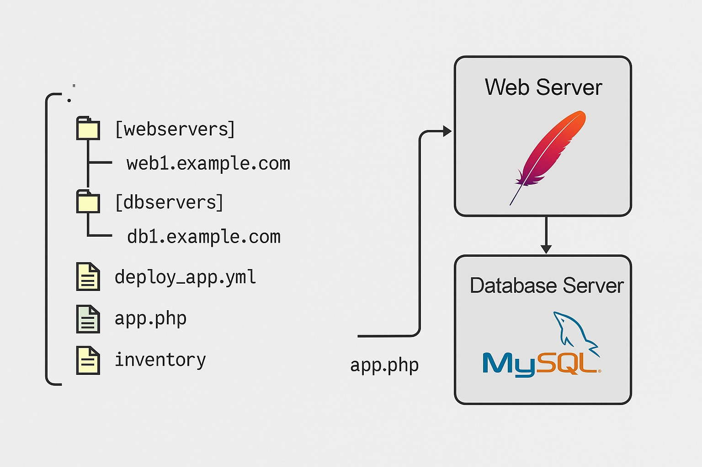

# Introduction à Ansible

## Pourquoi Ansible ?
Ansible est un outil d'automatisation open§source conçu pour gérer et configurer des systèmes informatiques à distance. Il est largement utilisé pour l'administration système, la gestion des configuraitons, le déploiement d'applicaitons, ainsi que pour la gestion de l'infrastructure en tant que code (IaC : Infrastructure as Code).

- **Facilité d'utilisation** : Ansible utilise une synthaxe simple, déclarative et compréhensible/ La configuration est effectuée via des fichiers YAML (Yet Another Markup Language), qui sont faciles à écrire et à comprendre.
- **Agentless** : Contrairement à d'autres outils de gestion, Ansible n'a pas besoin d'un agent installé sur les systèmes distants. Il s'appuie sur SSH pour la communication avec les noeuds distants. 
- **Idempotence** : Ansible garantit que les configurations appliquées à un système ne le modifie pas s'il est déjà dans l'état désiré.
- **Extensible** : Vous pouvez étendre Ansible avec des modules personnalisés ou utiliser des rôles et collections existants.
- **Gestion de l'infrastructure** : Ansible permet de gérer les configurations, les déploiements et l'automatisation à échelle élevée. 

## Concepts fondamentaux d'Ansible
### Inventaire
L'inventaire est une liste de machines (hôtes) sur lesquelles Ansible va effectuer des actions. Il peut être statique ou dynamique. L'inventaire peut être sous forme de fichier texte ou d'un script générant la liste d'hôtes. <br>

*_Exemple d'un fichier d'inventaire statique_* : <br>
```
# /etc/ansible/hosts.ini

[webservers]
web1.example.com
web2.example.com

[dbservers]
db1.example.com
db2.example.com
```

### Playbooks
Un playbook Ansible est un fichier YAML qui contient une ou plusieurs "plays". Chaque "play" applique des tâches à un groupe d'hôtes. Un playbook peut inclure des rôles, des variables, des boucles, des conditions, etc.

*_ Exempled d'un simple playbook_*:
```
# playbook.yaml
---
- name : Installer et configurer Apache
  hosts : webservers
  become : True
  tasks : 
    - name: Installer Apache
      apt : 
        name: apache2
        state : present
    - name : Démarer Apache
      services : 
        name : apache2
        state : started
        enabled : yes
```

### Modules : 
Les modules sontdes unités de travail dans Ansible. Chaque module accomplit une tâche spécifique, comme installer un paquet, créer un fichier, redémarrer un service, etc. <br>
Quelques modules populaires:
- `apt` : Gestion des paquets sur les systèmes basés sur Debian
- `yum`: Gestion des paquetes sur les systèmes basés sur Red Hat
- `service`: Gestion des services (démarrer, arrêter, redémarrer)
- `copy` : Copier des fichiers d'une machine à une autre

### Rôles et Collections
Les rôles sont un moyen d'organiser les playbooks Ansible en réutilisant des configurations courantes. Un rôle peut inclure des tâches, des variables, des fichiers, des modèles, des handlers, etc. <br>

*_ Exemple de structure d'un rôle_* :
```
myrole\
    tasks\
        main.yaml
    files\
    templates\
    handlers\
    vars\
    defaults\
```

Les collections sont des ensembles de rôles et de modules qui peuvent être partagés et réutilisés dans Ansible.

### Variables et Templates
Les variables permettent de rendre un playbook dynamique en fonction de l'environnement.
Elles peuvent être définies dans le playboook, l'inventaire, ou des fichiers externes. <br>
Les templates sont des fichiers dynamiques générés par Ansible à l'aide de Jinja2, un moteur de templates.
Vous pouvez utiliser des variables dans vos fichiers de configuration pour personnaliser leur contenu.

# Cas Pratique
Utilisation de Ansible pour le déploiement d'un application web avec une architecture simple : 
un serveur web (Apache et une base de données MySQL).

## Pré-requis
1) Configuration d'une VM GCP telle que:
- Région : europe-west-9 (Paris)
- Type de machine : e2-standard-4 (4 vCPU, 2 coeur(s), 16 Go de mémoire)
- Ajout de la clé SSH de l'ordinateur courant pour VSCode :
    - `ls ~/.ssh` (Linux/MacOS) / `dir $HOME\.ssh` (Windows) (présence d’une clé SHH « id_rsa »)
    - `cat ~/.ssh/id_rsa.pub` (afficher la clé SSH à insérer sur GCP dans la section "Clé SSH")

## Architecture:
- Serveur Web (Apache) : Ce serveur héberge une application PHP et communique avec la base de données.
- Serveur DB (MySQL) : Ce serveur héberge une base de données MySQL.



## Etapes du déploiement 
1) Installation de MySQL sur le serveur DB
2) Configuration de la base de données
3) Installation d'Apache et de PHP sur le serveur Web
4) Déploiement de l'application PVP avec la configuration adéquate

## Exécution des playbooks
`ansible-playbook -i /etc/ansible/hosts deploy_app.yml`

## Bonnes pratiques
- **Utilisation des variables** : Utiliser des variables pour rendre vos playbooks plus flexibles et réutilisables.
- **Gestion des Secrets** : Utiliser Ansible Vault pour chiffrer des informations sensibles comme les mots de passe.
- **Idempotence** : Assurez§vous que vos playbooks sont idempotents, c'est-à-dire qu'ils peuvent être exécutés plusieurs fois sans changer l'état du système si ce dernier est déjà dans l'état désiré.
- **Tests** : Utilisez des outils comme "ansible§lint" pour vérifier la synthaxe et les bonnes pratiques dans bos playbooks.
- **Rôles et Collections** : Organisez vos playbooks en rôles pour les rendre réutilisables et faciles à maintenir.

## Conclusion
Ansible est un outil puissant pour automatiser la gestion des configurations et le déploiement d'applications. Grâce à sa synthaxe simple, ses modules variés et sa capacité à travailler sans agent, il est particulièrement adapté aux environnements DevOps et d'infrastructure cloud. 
En utilisant Ansible pour des tâches comme le déploiement d'applications, l'administration des systèmes ou le gestion de la configuration, vous pouvez améliorer l'efficacité de vos équipes et réduire les erreurs humaines.

### Utilisation du repo
1) Installation de Git sur la VM :
- `sudo apt update` (mise à jour des packages)
- `sudo apt install git -y` (installation de Git)

2) Clôner le repo du projet : `git clone https://github.com/2FromField/Ansible_project.git`


